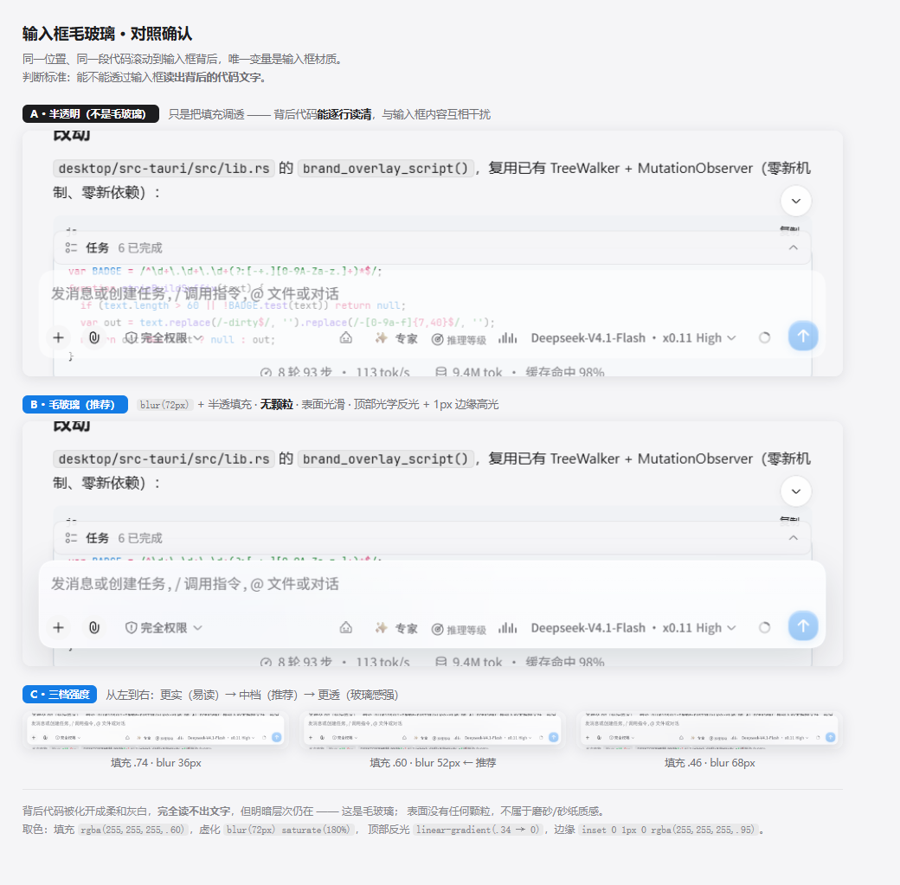
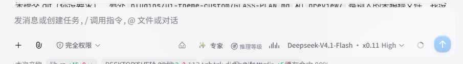
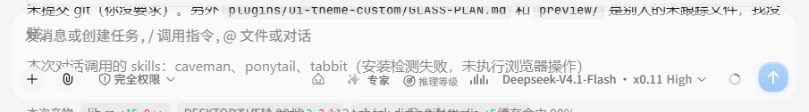
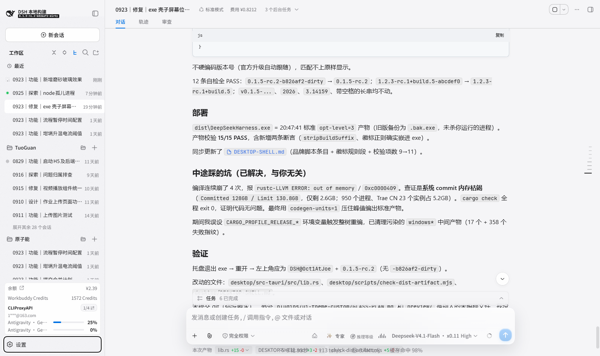
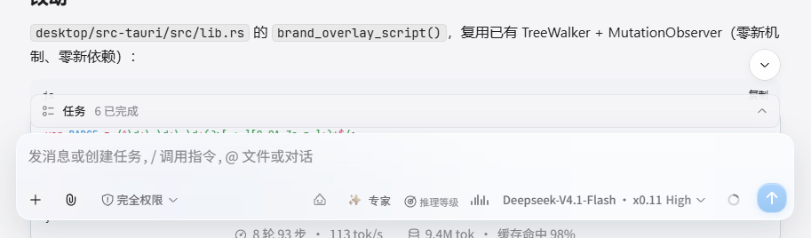
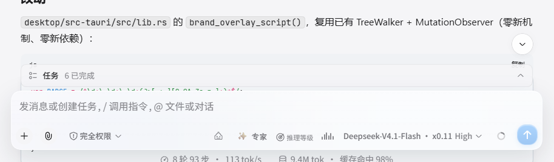

# 毛玻璃效果实现参考

> **材质定义（必读）**：本项目做的是**毛玻璃（frosted glass）**，不是**磨砂（grain / 砂纸）**。
>
> | | 毛玻璃（本项目） | 磨砂（已否决） |
> | :--- | :--- | :--- |
> | 表面 | **光滑无颗粒** | 有微观颗粒 |
> | 背后内容 | 被 blur 化开，隐约见明暗但读不出字 | 颗粒叠在内容上 |
> | 实现 | `backdrop-filter: blur()` + 半透填充 + 光学反光 | 额外叠噪声纹理层 |
>
> 历史：曾误做成磨砂，叠 SVG 分形噪声（`feTurbulence` + 去色）。
> 该噪声 rect 带满 alpha，叠加会**同时压暗整体明度** —— 强度 0.20→0.12→0.05→0.03
> 一路调都只是「糊了一层灰雾」的脏感，方向本身错误，调参无解。已彻底移除。

---

## 核心原理

毛玻璃的观感**全部来自 `blur()` 化开背后真实内容**，不需要任何颗粒。

```
视觉效果 = 半透明填充（透光）+ blur 化开背后内容（磨砂感）+ 顶部光学反光 + 1px 边缘高光
```

### 两条独立的轴（最容易做反的地方）

| 轴 | 控制量 | 调高会怎样 | 调低会怎样 |
| :--- | :--- | :--- | :--- |
| **透多少** | 填充 alpha | 看不到背后（变白板）❌ | 背后越来越明显 |
| **糊多狠** | `blur()` 半径 | 文字化得越干净 ✅ | 文字会透出来 |

用户确认参数（t3）：**填充 `.38` + `blur(92px) saturate(180%)`**。

> 🚨 典型错误：为了让背后文字看不清而去**提高填充 alpha** —— 那会变成一块看不到背后的白板。
> 遮住文字**只能靠 blur 半径**。
> 验证方法：同样填充 `.48`，`blur` 取 `6px` 与 `84px` 对比，6px 时文字清晰可读。

### ⚠️ 前提：背后必须有内容

`blur(纯色) = 纯色`。若面板背后是均匀纯色，`backdrop-filter` **数学上不可能生效**。

实测踩坑：`composerSeat` 自刷一层实色压底
`linear-gradient(transparent 0, rgb(245,245,247) 36px)`，叠加纯色 `bg-base` 后，
输入框背后恒为纯色 —— 不先清掉这层，毛玻璃 CSS 写了也是白写。

```css
/* 结构层前提（必做） */
[class*="composerSeat"]{ background-image:none !important; }
```

---

## 参数出口（单一来源）

全部定义在 `src/client/index.ts` 的 `SURFACE_GLASS_CSS`，六主题共用：

```css
body[data-ds-custom-theme]{
  --dsh-glass-blur:blur(92px) saturate(180%);
  --dsh-glass-fill:rgba(255,255,255,0.38);   /* 浅色 */
  --dsh-glass-sheen:linear-gradient(180deg, rgba(255,255,255,.30) 0%, rgba(255,255,255,.05) 48%, rgba(255,255,255,0) 78%);
  --dsh-glass-edge:rgba(255,255,255,0.96);
  --dsh-glass-rim:rgba(255,255,255,0.58);
  --dsh-glass-bottom:rgba(255,255,255,0.40);
  --dsh-glass-dialog-fill:rgba(255,255,255,0.78);  /* 弹窗单独一档，更实 */
}
/* 深色：填充与高光必须取深色系值 —— 照抄白色会发灰，与暗底割裂 */
body[data-ds-custom-theme][data-ds-dark-theme]{
  --dsh-glass-fill:rgba(26,30,38,0.46);
  --dsh-glass-edge:rgba(255,255,255,0.16);
  --dsh-glass-rim:rgba(255,255,255,0.10);
  --dsh-glass-bottom:rgba(255,255,255,0.06);
  --dsh-glass-dialog-fill:rgba(26,30,38,0.78);
}
/* 缃素：用户要求保持「纯色温润、无光晕」路线 —— 参数就地归零，
   下游所有规则无需主题特判，材质自动关闭。 */
body[data-ds-custom-theme="parchment"]{
  --dsh-glass-blur:none;
  --dsh-glass-fill:var(--dsw-alias-bg-layer-2, rgb(232, 225, 212));
  --dsh-glass-sheen:linear-gradient(transparent, transparent);
  --dsh-glass-edge:transparent;
  --dsh-glass-rim:transparent;
  --dsh-glass-bottom:transparent;
  --dsh-glass-dialog-fill:var(--dsw-alias-bg-overlay, rgb(236, 230, 218));
}
```

---

## 分级原则（决定哪些节点该上玻璃）

`backdrop-filter` 的收益取决于**背后是什么**：

| 级别 | 判据 | 处理 |
| :--- | :--- | :--- |
| **A 组** | 背后**有内容滚过** | 完整毛玻璃：填充 + `blur(92px)` + 光学边缘 |
| **B 组** | 背后是**均匀纯色** | 只给填充 + 光学边缘，**不加 blur**（零收益且耗性能） |
| **C 组** | 瞬态浮层（设置弹窗、权限菜单、指令面板、模型选择等） | 接入 `--dsh-glass-popover-fill`，统一 20px 圆角与大投影 |

完整节点清单见 [GLASS-NODES.md](GLASS-NODES.md)。

### 🚨 输入坞三大浮层样式统一（权限、模型选择、指令面板）

输入坞（composer）唤起的三个弹出面板因来源和组件不同，曾出现严重割裂：
- **权限面板**（官方 `[role="menu"]`）：标准毛玻璃，`blur(92px)` + `.72` 填充；
- **模型选择面板**（第三方插件 `dsh-better-reasoning-effort`）：外层有 blur，但顶部搜索框 `.bre-model-search-box` 写死了实底灰，破坏通透感，且带原生粗滚动条；
- **指令面板**（官方 `ui-input-trigger`，`<div class="uOspIa_menu">`）：挂在 `[class*="overlayAnchor"]` 下，**无 `role="menu"` 属性**，导致完全漏掉了 C 组规则，无 blur 且底层文字无虚化直接穿透重叠。

**统一方案**：
1. C 组选择器增加 `[class*="overlayAnchor"] [class$="_menu"]`，赋予完整的毛玻璃背景、92px 模糊、20px 圆角与发丝高光；
2. 内部项圆角统一为 12px，激活态统一为克制的高光微透明底；
3. 治理 `bre-model-search-box` 灰底，改为通透背景 + 磨砂胶囊 input 槽；
4. 浮层内全量滚动条细化为 5px 半透优雅轨道。

### ⚠️ 性能红线：列表项绝不挂 blur

实测踩坑：曾把侧栏会话行 `dsh-ff__session-row` 放进 A 组，结果
**40+ 个会话行各挂一个 `blur(92px)`**，页面 `backdrop-filter` 节点数飙到 **49**。
而这些行背后是侧栏自身的纯色填充，blur 看不出任何差别，纯属白烧 GPU。

**修正后降到 9 个节点。** 列表类元素一律归 B 组。

### 🚨 嵌套 backdrop root：父层带 blur 会让子浮层的 blur 静默失效

用户反馈「对话框里权限展开的选择面板透明度太高、没有背景高斯模糊」。
实测该菜单的 computed `backdrop-filter` **确实是 `blur(92px)`**，却看不出任何模糊。

根因（主因，极易误判）：**该菜单是输入坞卡片的 DOM 后代**。实测祖先链：

```
[role="menu"]  →  _root_1nxmc_1  →  QwfZkG_modes  →  QwfZkG_tools
               →  QwfZkG_row  →  QwfZkG_card（输入坞卡片，自带 backdrop-filter）
```

CSS 规范：带 `backdrop-filter` 的元素会建立新的 **backdrop root**，
其后代的 `backdrop-filter` **只能模糊该 root 内部已合成的内容**。
而卡片内部是均匀填充 → 菜单等于「模糊了一个寂寞」。

**正解**：把父层（输入坞卡片）的 blur 移到 `::before` 伪元素 ——
伪元素不是菜单的祖先，不会为后代建立 backdrop root。

```css
/* ① 卡片自身去 blur，并建立 stacking context 让 ::before 的 z-index:-1 生效 */
[class*="composerSeat"] [class$="_card"]{
  position:relative; z-index:0;
  backdrop-filter:none !important;
}
/* ② blur 迁到伪元素 */
[class*="composerSeat"] [class$="_card"]::before{
  content:''; position:absolute; inset:0; pointer-events:none; z-index:-1;
  border-radius:inherit;
  backdrop-filter:var(--dsh-glass-blur,none) !important;
}
/* ③ 卡片内含菜单时抬层，保证浮层在上 */
[class*="composerSeat"] [class$="_card"]:has([role="menu"]){ z-index:9500 !important; }
```

> 这与本项目对 `sidebarCol` 已确立的做法**同源**（伪元素挂 blur，避免为
> `position:fixed` 后代建立包含块）。**任何"父容器 + 内部弹出浮层"的组合都要这样处理。**

**次要原因**：菜单早期沿用了输入坞的 `.38` 填充过于通透，后来提升到 `.72` 又略显发实。
经多档对比（.48 / .56 / .62 / .72），最终锁定 `--dsh-glass-popover-fill: rgba(255, 255, 255, 0.56)`（深色 `.82`）：
既能清晰呈现选项文字，又能隐约透出底层内容的灰影轮廓，并在 `blur(92px)` 强高斯模糊下彻底化开、无法读出具体字迹，达到极致通透的毛玻璃漫反射深度。

---

## 各主题表现

> 🚨 **玻璃材质只服务 液态 sequoia 与 曜黑 sonoma 两个主题。**
> 用户实测确认：「只有给液态以及曜黑这两个主题加好看，其他 4 个主题加了都不好看」。
> 冥夜 void / 银曜 jade / 灼日 solar / 缃素 parchment **完全不加玻璃**，保持官方原始外观。

| 主题 | 玻璃材质 | 填充 | blur |
| :--- | :--- | :--- | :--- |
| **sequoia 液态** | ✅ 有 | `rgba(255,255,255,.38)` | 92px |
| **sonoma 曜黑** | ✅ 有 | `rgba(26,30,38,.46)` | 92px |
| void 冥夜 | ❌ 无 | —（官方原样） | — |
| jade 银曜 | ❌ 无 | —（官方原样） | — |
| solar 灼日 | ❌ 无 | —（官方原样） | — |
| parchment 缃素 | ❌ 无 | —（官方原样） | — |

> 注：A 组的 blur **刻意不用各主题的 `--dsw-alias-glass-blur`**。
> 该 token 六主题差异极大（64/50/24/20/20/`none`），20~24px 达不到
> 「隐约看到但读不清」的要求，故统一用 92px，主题差异由填充色体现。

> ⚠️ **无玻璃的 4 个主题仍带「顶部融合屏障」**：这不是玻璃材质，而是消除
> 顶栏与侧栏之间色差断层的通用规则（见下方「融合屏障」一节）。两者互不冲突。

---

## 效果图

| 图 | 说明 |
| :--- | :--- |
|  | **核心判据**：同一位置同一段代码滚到输入框背后。左「半透明」背后代码能逐行读清；右「毛玻璃」被化开、读不出字。 |
|  | **决定性验证**：同填充同位置，仅切换 `backdrop-filter` 有无。证明毛玻璃感来自 blur 化开背后内容，与填充/颗粒无关。 |
|  | 上图的对照组：去掉 blur 后，背后正文立刻可读。 |
|  | 整页效果。 |
|  | **用户选定档**：填充 `.38` + `blur(92px)`。 |
|  | 备选档：填充 `.48` + `blur(84px)`（若将来觉得 t3 太透可回退到此档）。 |

---

## 两条实测踩坑（用户反馈后修正）

### 踩坑 A：闭合 1px 描边在列表项上变成「外边框」

初版 B 组给每个节点都加了闭合 rim：

```css
box-shadow: inset 0 1px 0 <高光>, inset 0 0 0 1px <亮边>;   /* ❌ 小控件上出问题 */
```

在大面积浮层上这是玻璃厚度感，但在**列表项 / 小控件**上，
每一项都会出现一圈完整矩形白线 —— 用户实测反馈「每个单独 DOM 都有外边框」。

**正解**：列表项与小控件**一律不施加任何 box-shadow**（连顶部高光也不行）。

```css
/* B 组（侧栏会话行、导航项、下拉、色块…）—— 全部交还官方原始样式 */
box-shadow: none !important;
```

> 第二轮踩坑：先改成「只留顶部高光」`inset 0 1px 0`，**仍然出线** ——
> 会话行高仅 36px，每行顶边一条近乎纯白的 1px 线（浅色 `.96` alpha），
> 多行堆叠起来就是「每个小 DOM 之间的横向边线」。
> 顶部高光只适用于有独立圆角、且不与同类紧贴的大面积浮层。

> 第三轮踩坑（成本卡）：官方自带 `border` + `elevation` 外环，叠加我给的
> 闭合 rim 后成为**三重描边**，用户反馈「外面还有一层包边」。
> 处理：去掉闭合 rim 与外环，只留顶部高光 + 底部回光两道单向内光。

### 踩坑 B：`blur(纯色) = 纯色` —— 这是物理限制，不是 bug

AI 回复卡片宽 845px，**背后就是对话区根背景本身**。
能否显出玻璃感，取决于该主题 `--dsw-alias-bg-app-image` 是否有内容：

| 主题 | `bg-app-image` | 卡片表现 |
| :--- | :--- | :--- |
| sonoma | 有紫/蓝/粉彩色光斑底 | 透出后玻璃质感明显 ✅ |
| **sequoia** | **`none`** | **背后恒为纯色，透不出任何东西**，只能呈现顶部反光 + 轻微明度差 |

> **sequoia 的取舍（用户两次明确表态，最终决定）**：
> 曾试行「方案 B」—— 恢复一层极淡冷调光晕给卡片当底衬，卡片确有玻璃感。
> 但用户随后明确要求「**液态主题的光晕我不要，去掉就好，其他效果都保留**」，
> 故已回退为 `bg-app-image: none`。
> **代价已知并接受**：sequoia 的 AI 卡片不会有 sonoma 那样的通透感。
> 这是「不要光晕」的必然结果，**不是缺陷，不该当回归去修**。

### 踩坑 C：侧栏顶部与顶栏的色差断层（六主题）

用户反馈「左右侧边栏跟顶部栏反差太大，没有像中间一样自然过渡」。
根因：中央内容区带「同色屏障 + 渐隐」，而**侧栏与右栏面板没有** ——
它们顶部直接暴露半透明填充与光斑。逐像素实测（修复前）：

| 主题 | 左栏顶部 | 中央顶部 | 差值 |
| :--- | :--- | :--- | ---: |
| void | `RGB(38,38,43)` | `RGB(13,13,16)` | **25 阶** |
| solar | `RGB(49,39,31)` | `RGB(18,14,16)` | **31 阶** |
| parchment | `RGB(226,219,206)` | `RGB(230,224,212)` | 4.8 阶 |

**修法**：把屏障提到**通用规则**（不分主题、不分深浅），
用 `var(--dsw-alias-bg-base)` 让每个主题自动取到自己的底色：

```css
body[data-ds-dark-theme] [class*="sidebarCol"] > * > [class*="root"],
body:not([data-ds-dark-theme]) [class*="sidebarCol"] > * > [class*="root"] {
  background:
    linear-gradient(180deg,
      var(--dsw-alias-bg-base) 0,
      var(--dsw-alias-bg-base) var(--dsh-fusion-top, 44px),
      /* 渐隐过渡，非硬切边 */
      color-mix(in srgb, var(--dsw-alias-bg-base) 55%, transparent) calc(var(--dsh-fusion-top, 44px) + 52px),
      transparent calc(var(--dsh-fusion-top, 44px) + 100px)) no-repeat,
    /* …主题原有材质… */;
}
```

> ⚠️ **一道屏障覆盖全部 6 个主题**，靠的是 `bg-base` 变量而非写死色值。
> 若改成写死某个主题色，就会退化成「只对一个主题有效」——
> 门禁已加断言锁死这一点。

> ⚠️ 屏障必须是 `linear-gradient` 的**第一项**（最上层），否则被光斑盖住。
> 且**不得是硬切边**（`transparent 44px`）——实测硬切边在 y=44 处
> ΔL=-10.8，是一条突兀的暗色断崖；渐隐后同一位置 ΔL=-1.0（不可辨）。

---

## 验证方法

1. **必须先把内容滚到目标节点背后再截图**，否则纯色背景下看不出毛玻璃。
2. 检查项：
   - **输入坞**（仅 sequoia/sonoma）：能透出背后正文并被化开，读不出字
   - **侧栏 / 右面板**：半透 + 顶部同色融合屏障（无 blur、无任何 box-shadow）
   - **设置弹窗**（仅 sequoia/sonoma）：毛玻璃且文字可读（填充 `.78` 更实）
   - **AI 回复卡片**（仅 sequoia/sonoma）：sequoia 受「无光晕底」物理限制
   - **其余 4 主题**：无任何玻璃材质，但**顶部衔接必须与中央一致**
3. 统计 `backdrop-filter` 节点数，应约 **8~10**；若飙到几十，说明列表项被误挂 blur。
4. 跑门禁：
   ```powershell
   node tests\badge-token-check.mjs
   node tests\sequoia-neutral-check.mjs
   node tests\font-size-check.mjs
   ```

---

## 维护硬规则

1. **禁止写构建哈希前缀**（如 `GwCMNq_chip`、`XvM5kW_frame`）——换版本即失效。
   只用稳定语义片段：`composerSeat` / `sidebarCol` / `dsh-ff__` / `role="dialog"` 等。
2. **禁止依赖源码目录名**（如 `InputBar_card`、`ChatView_column`、`AssistantMarkdown_root`）。
   CSS Modules 产出的是 `<hash>_<localName>`，源码名从不出现在 DOM。
   曾因此导致 8 条规则实测命中为 0，整个玻璃效果静默失效。
3. **`backdrop-filter` 严禁挂 `[class*="sidebarCol"]` 主元素** ——
   设置弹窗 Portal 挂在该子树下，`backdrop-filter` 会为 `position:fixed` 后代
   创建包含块，把弹窗宽度压成侧栏同宽。只能挂 `::before` 伪元素。
4. **融合屏障不可破坏**：侧栏顶部 44px 与壳顶栏逐字节同色，侧栏内容层 `box-shadow` 必须为 `none`。
5. **变量引用一律带兜底**（`var(--x, 默认值)`），否则未定义时整条声明失效。

---

## 添加新主题的步骤

1. 在 `src/client/` 下创建 `<name>.ts`，定义 `*_TOKENS`（参考现有主题）。
2. 在 `src/client/index.ts` 中导入 token、添加 `ThemeDefinition`、在 `ctx.effect()` 中 register。
3. 添加到 `THEME_TOKEN_MAP` / `THEME_SCHEME_MAP` / `TITLEBAR_PRESETS`。
4. 新主题**无需**写玻璃 CSS —— 浅/深两套 `--dsh-glass-*` 自动覆盖；
   若要走纯色路线（如缃素），加一条 `body[data-ds-custom-theme="<id>"]` 参数归零即可。
5. 在 `src/client/locales.ts` 加中英文标签，在 `TechThemeRow.tsx` 的 `CUBES` 加主题方块。
